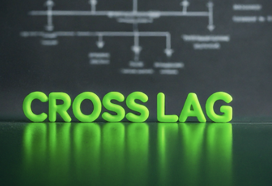

::: {style="display: flex; align-items: center;"}
::: {style="margin-right: 20px; flex: 1;"}
# CrossLag

This package develops an analytic framework to analyze panel data in the tradition of the Cross Lagged Panel Model -- the CLPM. This repository contains code written by Stanley Feldman, Adam Parish and Chris Weber to critique and improve upon the cross lag regression. 

The **Cross-Lagged Regression (CLR)** model was pioneered in Campbell (1963) as well as Campbell and Stanley (1963) and is an oft used, intuitive method to test **competing causal processes**. The model requires the estimation of lagged effects, including a lag of the dependent variable. By analyzing the lagged effects (the influence of one variable on the other at a later time point), researchers often purport to gain insights into the direction and strength of causal relationships.
:::

:::

In the language of causal reasoning, the Directed Acyclic Graph (DAG) for the CLR model can be expanded to incorporate commonly encountered data issues arising with the CLPM, mediation, confounding, and collision.

# connect to git repository

